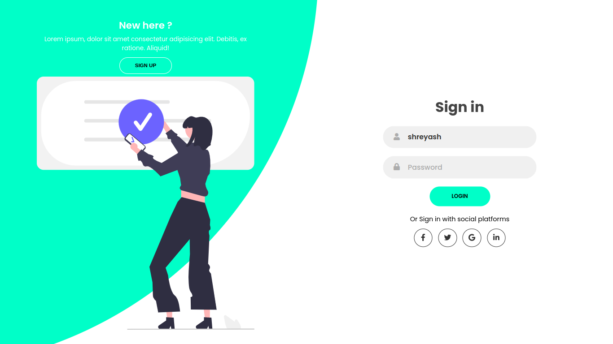
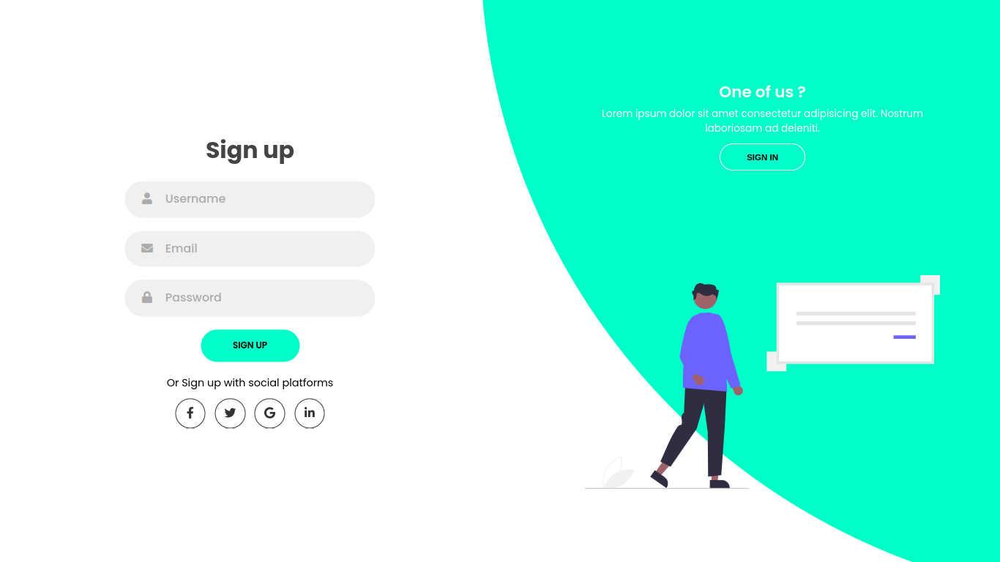

# Signup-signin.github.io
<h1 align="center">Hi 👋, I'm Shreyash Gaikwad</h1>
<h3 align="center">A passionate frontend developer from India</h3>
My first Sign Up and Sign In page using 👨‍💻 basic Frontend languages i.e **HTML,CSS & JS**.
  
  
<h3 align="left">Connect with me:</h3>

<h3>You cam check how It works ------> </h3>
<a href="https://shreyash96og.github.io/Signup-signin.github.io/">ClickHere</a>
